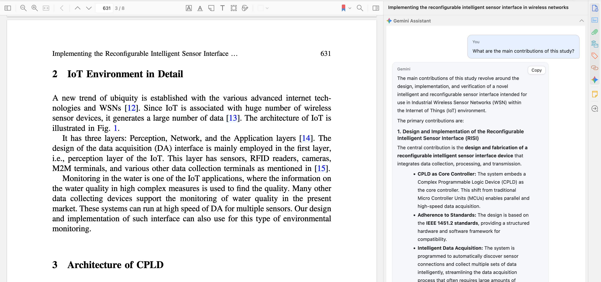

# Gemini for Zotero Plugin

[](https://www.zotero.org)
[](https://www.gnu.org/licenses/agpl-3.0)

A Zotero 7 plugin that brings Google Gemini chat into your reading workflow with PDF context and model selection.



## Features

- **Gemini Query Interface**:
  - Directly query Google Gemini with research questions
  - Stream responses in real-time
  - Access to all available Gemini models (auto-fetched from Google AI Studio)
  - Markdown rendering for responses (tables, task lists, superscripts)

- **PDF Context**:
  - Attach PDF content or files to improve answer relevance
  - Automatic single-attachment per session to avoid re-uploading the same PDF

- **UI Integration**:
  - Dedicated reader-pane sidebar chat
  - New session button to clear history
  - Copy button for assistant responses

- **Configuration**:
  - Set Google AI Studio API key and model preferences and you are ready to go!

## Installation

1. Download the latest `.xpi` file from the [Releases page](https://github.com/joaocarlos/zotero-gemini/releases)
2. In Zotero, go to Tools → Add-ons
3. Click the gear icon and select "Install Add-on From File"
4. Select the downloaded `.xpi` file
5. Restart Zotero

## Configuration

1. Obtain a Google AI Studio API key from [https://aistudio.google.com/app/apikey](https://aistudio.google.com/app/apikey)
2. In Zotero, go to Tools → Zotero Gemini Settings
3. Enter your API key
4. (Optional) Select a model or click "Refresh Models" to see all available models
5. Click "Refresh Models" to fetch the latest available Gemini models

### PDF Handling

- If a PDF is available, the toggle is enabled by default and will attach it with the next message.
- After the PDF is attached once, the toggle is automatically disabled to avoid re-uploading the same file.

### Rate Limits

Google applies rate limits per model and per account. If you hit limits, try switching models, waiting a few minutes, or checking your usage at [https://ai.dev/usage](https://ai.dev/usage).

## Development

### Prerequisites

- [Zotero 7](https://www.zotero.org/support/beta_builds)
- [Node.js](https://nodejs.org/en/)
- [Git](https://git-scm.com/)

### Setup

1. Clone the repository:

   ```bash
   git clone https://github.com/joaocarlos/zotero-gemini.git
   cd zotero-gemini
   ```

2. Install dependencies:

   ```bash
   npm install
   ```

3. Configure environment variables by copying `.env.example` to `.env` and updating the paths:

   ```bash
   cp .env.example .env
   ```

### Running in Development Mode

```bash
npm run dev
```

This will:

- Start the development server
- Launch Zotero with the plugin loaded from the `build/` directory
- Open developer tools
- Watch for changes in `src/` and `addon/` directories and automatically reload
- Set `NODE_ENV=development` for dev-time behavior

This avoids reinstalling the `.xpi` on every change.

### Building for Production

```bash
npm run build
```

The production build will be created in the `build/` directory.

## License

This project is licensed under the AGPL-3.0-or-later License - see the [LICENSE](LICENSE) file for details.

## Acknowledgments

- Built using the [Zotero Plugin Template](https://github.com/windingwind/zotero-plugin-template)
- Uses [zotero-plugin-toolkit](https://github.com/windingwind/zotero-plugin-toolkit) for plugin utilities
